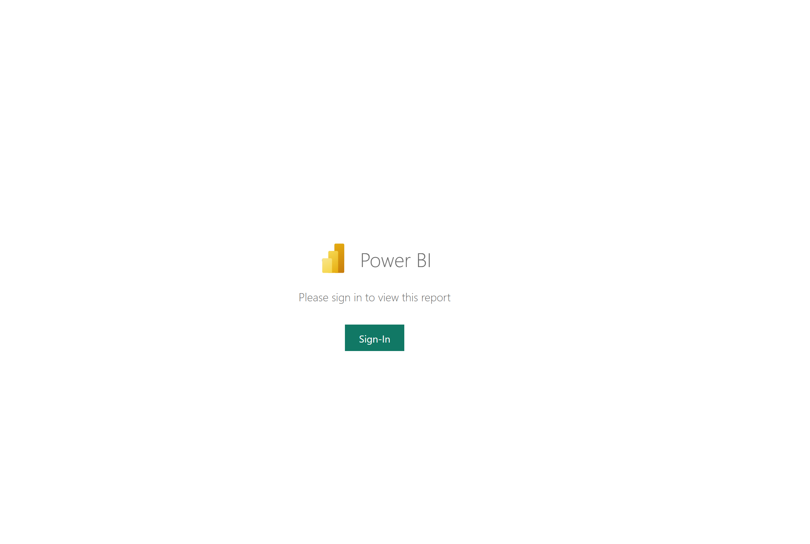
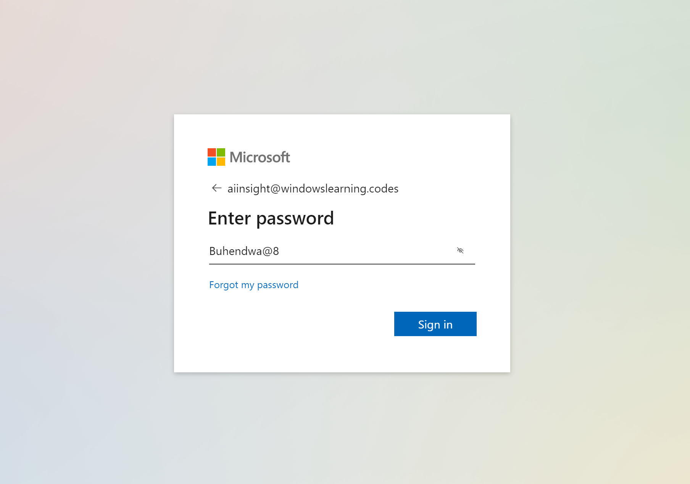
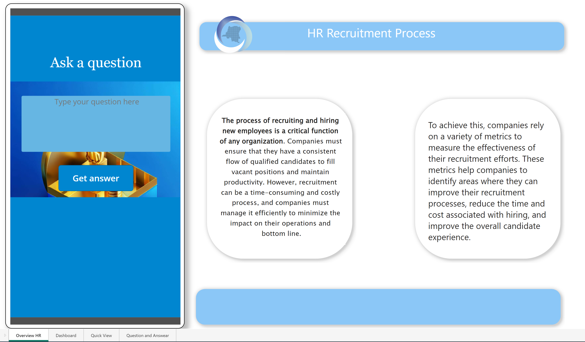
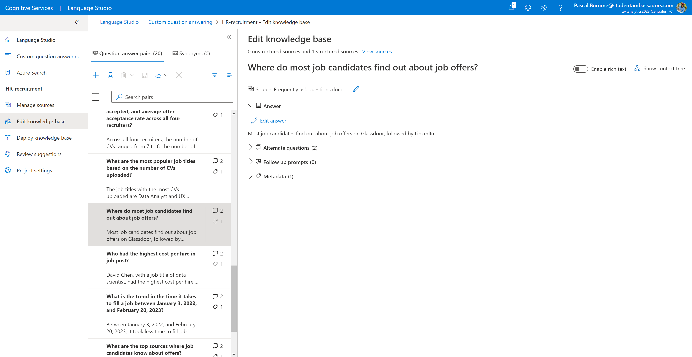
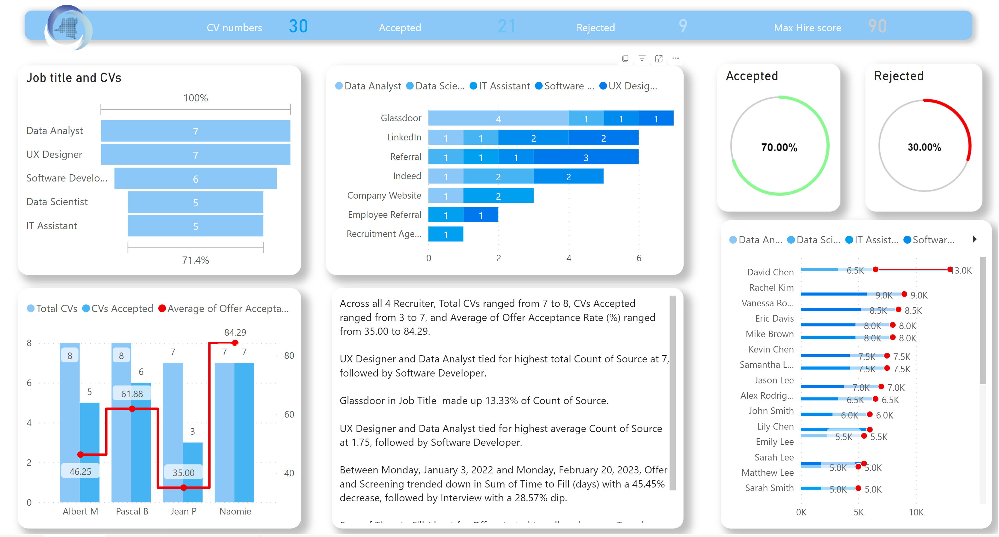
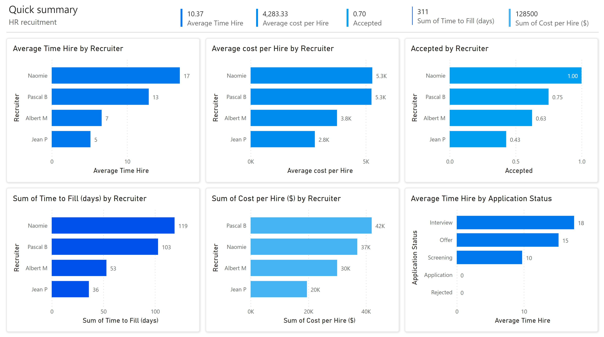
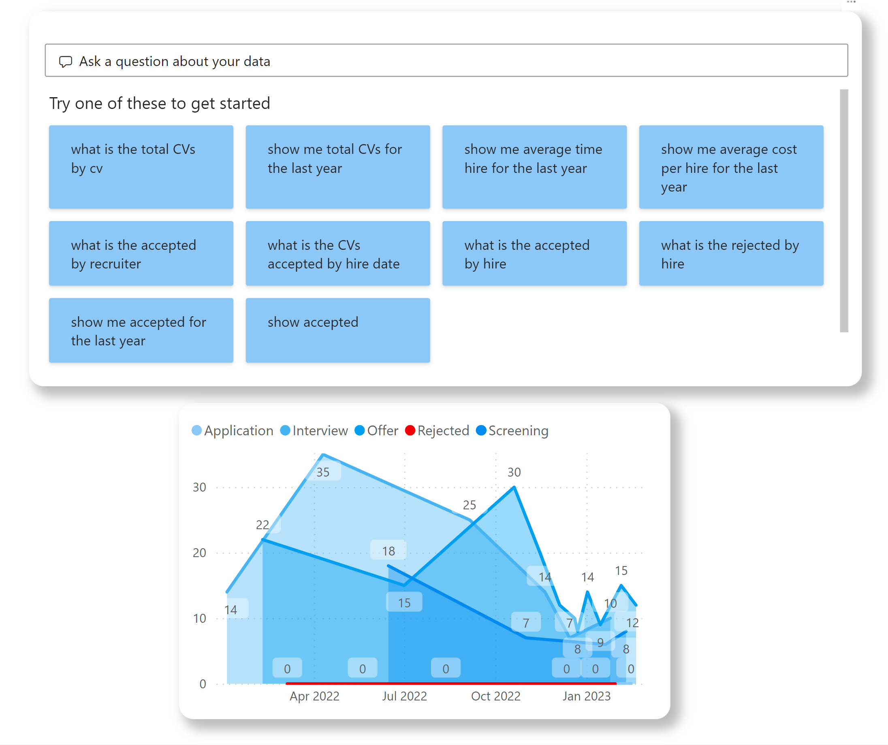

# HR-recruitment
Recruitment is a crucial process for any organization as its success can significantly impact the overall success of the business. Traditional recruitment methods can often be time-consuming and inefficient, leading to delayed hiring decisions and missed opportunities.

# Problem
In today's highly competitive job market, effective recruitment is essential for organizations to attract and hire the best talent. The quality of hires can have a significant impact on the overall success and performance of the business. However, traditional recruitment methods, such as manually reviewing resumes and conducting in-person interviews, can be inefficient and time-consuming.
These outdated recruitment techniques can lead to missed opportunities and delayed hiring decisions, which can harm an organization's competitiveness in the job market. Organizations that rely solely on these methods risk losing out on top candidates to competitors that are using more modern, efficient recruitment strategies. 
To stay ahead of the competition and attract the best talent, organizations should consider adopting modern recruitment methods that leverage technology and data analytics. By doing so, they can streamline their recruitment processes and make better hiring decisions more quickly, leading to improved business outcomes and a more successful organization.
To overcome these problems, we proposed our HR recruitment process project with Microsoft services and technologies.

# Solution 
Within  our project organizations can now leverage various tools and platforms to optimize their recruitment processes, improving efficiency, accuracy, and cost-effectiveness.
Our project aimed to enhance the efficiency and effectiveness of the HR recruitment process through the use of Microsoft's Power Platform. To achieve this goal, we employed Power BI to track essential recruitment KPIs such as cost per hire, time to hire, and recruiter efficiency. Additionally, we created a Frequently Asked Questions resource using Power Apps to provide quick access to HR process-related information for HR managers and other users. Additionally, we utilized Power Automate to automate the task of requesting information from Azure Cognitive search and filling it into Power Apps to respond to queries.
This integration ensured that users could access accurate and helpful information quickly and easily, ultimately leading to a more efficient and effective recruitment process.

# Guide 
## Application access
Firstly you need to connect via the link of the application : https://app.powerbi.com/reportEmbed?reportId=3f7b2508-5d58-4cfd-bca9-6e3a4c167246&appId=dbda3973-13a5-4d4f-bff4-26d7839c35fa&autoAuth=true&ctid=d235b41c-5ee9-4c60-bcff-d68fe3bff6a0

Then add credentials for getting access to the app : `aiinsight@windowslearning.codes`
password : `Buhendwa@8`

In this fist Overview, we have information about Power Apps application and information about HR recruitment process. This allows you to welcome the users. 

## Ask question
Ask a question It is the Power Apps application, which is integrated into Power BI, this component It allows user to ask questions about HR recruitment process, this allows to get answers about frequent ask questions about HR recruitment quickly. The Apps use a smart search engine with Azure Cognitive search and combine with Power Automat, to automate the action between Power Apps and Azure Cognitive search.

Here we use `question answering`.
Question answering provides cloud-based Natural Language Processing (NLP) that allows you to create a natural conversational layer over your data. It is used to find appropriate answers from customer input or from a project.

## Power Automate
We have used Power Automate to set up a workflow and connect to Power Apps with the question answering service. The workflow will include an HTTP request to send the user's  question to the prediction URL of the question answering service and get a matched answer back.

## Metrics
Performance KPI, give a metric about HR recruitment process, such as Cost-per-hire which is the total cost associated with filling a job opening, including job postings, recruiter fees, background checks, and other expenses. Recruiter efficiency which is the number of qualified candidates sourced per recruiter and combine with average percentage of percentage pour candidates who rate the recruitment process positively, including factors such as communication, transparency, and fairness.

## Quick summary 
Quick summary, give an overview of different fields according to average and sum. This allow to reinforce the decisions based on visualization according to the observation of some metrics. 

## Question and Answear 
`Question and answer`, this last report give a possibility to a user or HR manger, to ask questions and get an insight visual base on data sources, we have too a graphic which shows time-to-hire that refers to the average time it takes to fill a job opening, which includes the time from posting the job to when a candidate is offered and accepts the position or rejected.

# Conclusion 
The use of technology has revolutionized various aspects of businesses, including HR recruitment processes. Microsoft's Power Platform provides an efficient and effective solution for optimizing recruitment processes, from tracking recruitment KPIs to automating information requests and providing easily accessible HR process-related information.
By leveraging the capabilities of Power BI, Power Apps, and Power Automate, organizations can enhance the efficiency, accuracy, and cost-effectiveness of their recruitment processes, ultimately leading to better hiring decisions and greater organizational success.
As technology continues to advance, it is essential for businesses to embrace and leverage new tools and platforms to stay ahead of the competition. The integration of Microsoft's Power Platform into HR recruitment processes is a prime example of how technology can significantly improve organizational productivity and success.

